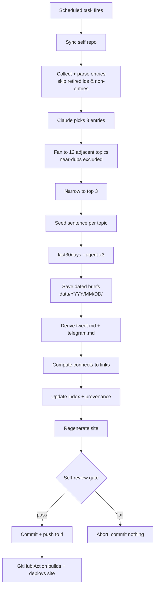

# Random Learning (rl)

## Summary

A daily, set-and-forget learning pipeline that runs on an always-on Mac Mini as a local Claude Code scheduled task. Each day it mines the user's private `self` link library, has Claude pick 3 entries → fan them into 12 adjacent topics → narrow to the top 3, researches each topic with the `last30days` skill, and commits dated learning briefs, a regenerated personal website (with "today connects to [past topic]" links), and length-checked social-post files into the `rl` repo — never repeating a topic, and gated by a self-review pass before anything lands.

---

## Problem Frame

The user captures links all day into a private `self` repo (via a Telegram bot), each stored as a markdown file with TOML frontmatter and a personal `why?` note explaining why it was worth saving. Those bookmarks accumulate steadily but rarely get revisited or deepened — saving a link is not the same as learning from it. There is no ritual that turns the growing library into daily, grounded learning, and no durable record of what has already been explored. The cost is a widening graveyard of interesting-but-untouched links and no compounding sense of having learned anything over time.

---

## Actors

- A1. Scheduler — a local desktop scheduled task on the always-on Mac Mini that fires the pipeline once daily, unattended.
- A2. Claude (orchestrator) — runs the project's local skill: makes the selection judgments, generates and narrows topics, drafts social copy, and runs the self-review gate.
- A3. `last30days` skill — the research engine; produces one grounded "last 30 days" brief per final topic.
- A4. `self` repo (private, read-only input) — the source link library the pipeline mines.
- A5. `rl` repo (output) — receives all committed artifacts and hosts the generated website.
- A6. Downstream posting bot (external, out of scope) — later consumes `tweet.md` / `telegram.md` from `rl` and does the actual X / Telegram posting.
- A7. The user — sole audience; reads the daily briefs and the site, and is the curiosity the selection optimizes for.

---

## Key Flows

- F1. Daily learning run (the core pipeline)
  - **Trigger:** the local scheduled task fires on the Mac Mini.
  - **Actors:** A1, A2, A3, A4, A5
  - **Steps:** sync `self` → collect and parse all eligible entries (skip retired `id`s and non-entry files) → Claude picks 3 entries → fan to 12 adjacent topics (near-duplicates excluded) → narrow to top 3 → write one seed sentence per topic → run `last30days` ×3 → save dated briefs → derive `tweet.md` + `telegram.md` → compute "connects to past topic" links → update the dedup index + provenance → regenerate the site → self-review gate → commit + push to `rl` on pass, abort on fail.
  - **Outcome:** `rl` has a new dated entry, an updated site, and social drafts; the index has grown; nothing repeats.
  - **Covered by:** R1–R20

- F2. Site publish
  - **Trigger:** a push to `rl`'s default branch (from F1).
  - **Actors:** A5
  - **Steps:** a GitHub Action builds the static site from all dated entries under `data/` → deploys to GitHub Pages.
  - **Outcome:** the site reflects the newest dated entry and its connection links.
  - **Covered by:** R15, R16

---

## Requirements

**Source ingestion**
- R1. Collect all eligible entries from the `self` repo across its `YYYY-wNN/` week directories, parsing each entry's TOML frontmatter (`id`, `kind`, `source`, `captured_at`, `local_date`, `iso_week`, `url`, `title`, `tags`) and body (description + the `why?` note).
- R2. Exclude from selection: non-entry files (e.g., `reflection`, `echo`), entry kinds deemed ineligible, and any entry whose `id` is already retired in the dedup index.

**Selection (Claude-judged)**
- R3. Each run, Claude selects 3 eligible entries, weighting the `why?` note most heavily, then `tags` and variety across the 3 picks.
- R4. Claude expands the 3 entries into exactly 12 adjacent/related topics that are genuinely interesting to the user and plausibly interesting to others, excluding any that fail the near-duplicate guard (R10).
- R5. Claude narrows the 12 down to the top 3, optimizing for the user's curiosity, freshness, and learnability.
- R6. Claude writes one framing sentence per final topic; that sentence is the query passed to `last30days`.

**Research**
- R7. For each of the 3 final topics, invoke `last30days "<topic>" --agent` (unattended agent mode) and capture the full brief.
- R8. Save each brief as a separate markdown file under `data/YYYY/MM/DD/` with a slug-based filename.

**Dedup and provenance (the freshness engine)**
- R9. Maintain a structured index that records, across all runs: retired source-entry `id`s, every published topic, and a near-duplicate signature per published topic.
- R10. The near-duplicate guard prevents re-publishing any topic that is an exact or semantic near-duplicate of a previously published one. v1 uses tag/title overlap plus a Claude judgment call; embeddings are deferred.
- R11. Record per-run provenance: the 3 source links, the 12 candidate topics, and a short rationale for why the final 3 were chosen.

**Connections over time**
- R12. For each published topic, identify the most-related past topic(s) from the index and store a "connects to" link, surfaced on that day's site entry. (Reuses the R9 signatures, pointed the other direction.)

**Social artifacts**
- R13. Generate `tweet.md` — concise, ≤ 280 characters — distilled from the day's 3 briefs.
- R14. Generate `telegram.md` — medium-concise, ≤ 4096 characters — distilled from the day's 3 briefs.

**Website**
- R15. Generate/regenerate a static site from all dated entries under `data/`, browsable by date (year / month / day), showing each day's 3 topics, briefs, provenance, and connection links.
- R16. The site rebuilds and deploys automatically when a new dated entry is pushed to `rl` (GitHub Action → GitHub Pages).

**Automation and review gate**
- R17. The whole pipeline runs unattended as a single daily local scheduled task on the Mac Mini, orchestrated by a project-local skill committed to the `rl` repo so the scheduled run can find it.
- R18. Before committing, Claude runs a self-review gate that verifies every artifact: briefs are non-empty and well-formed, `tweet.md` ≤ 280 and `telegram.md` ≤ 4096 (hard limits), citations are present, no error markers, the dedup guard was not violated, and connection links resolve.
- R19. If the review gate fails, the run commits nothing — it aborts and surfaces why, so a thin/bad-data day never ships partial or junk output.
- R20. On gate pass, commit and push all artifacts to `rl`'s default branch so the downstream bot and the site Action pick them up.

---

## Acceptance Examples

- AE1. **Covers R2, R9.** Given a source entry whose `id` is already in the index's retired list, when the daily run collects entries, then that entry is not eligible for selection.
- AE2. **Covers R4, R10.** Given a candidate topic that is a semantic near-duplicate of a previously published topic, when generating/narrowing topics, then it is excluded from the 12 and from the final 3.
- AE3. **Covers R13, R14, R18.** Given a generated `tweet.md` that exceeds 280 characters, when the review gate runs, then the run does not commit it — it regenerates within the limit or aborts.
- AE4. **Covers R7, R19.** Given `last30days` returns empty or errors for a topic, when the review gate runs, then the run aborts rather than committing an empty brief.
- AE5. **Covers R12.** Given today's topic is related to a topic published a month ago, when the site entry is generated, then it includes a "connects to [that past topic]" link.
- AE6. **Covers R16, R20.** Given the review gate passes and artifacts are pushed to the default branch, when the push lands, then the GitHub Action rebuilds the site and the new dated entry appears.

---

## Success Criteria

- The user opens the site most days to a fresh, genuinely interesting dated entry they actually want to read — and never sees a repeat over time.
- Over weeks, the site visibly shows learning compounding (growing breadth plus connection links), rather than drifting back to the same handful of attractor topics.
- A downstream implementer/agent can run the pipeline end-to-end unattended; a bad-data day fails closed (nothing committed) rather than publishing junk.
- `tweet.md` and `telegram.md` are always within their limits and ready for the downstream bot to post verbatim with no manual fixup.

---

## Scope Boundaries

### Deferred for later

- Weekly / monthly digest roll-ups of the week's topics.
- An RSS feed for the site.
- Embeddings-based near-duplicate guard (v1 uses tag/title overlap + Claude judgment).
- A feedback loop where post engagement nudges future topic selection.

### Outside this product's identity

- Actually posting to X or Telegram — the downstream bot owns posting; this project only writes the files into `rl`.
- Audience-growth machinery (SEO, polls, follower funnels) — this is a personal learning ritual, not a content business.
- Cloud / multi-user execution — single-user, runs on the user's own always-on Mac Mini.

---

## Key Decisions

- Run as a **local desktop scheduled task** on the always-on Mac Mini — not `/loop` (expires after ~7 days) and not a cloud routine (which would force vendoring `last30days` into the repo, a Full-network allowlist, and keys-as-env-vars). Rationale: durable, reuses the locally-installed `last30days`, local network and SSH, zero vendoring.
- **Claude-judged selection and self-review; deterministic scripts for the mechanical parts** (parsing, dedup, length checks, site build). Taste where it matters, boring/testable where correctness matters.
- **Commit artifacts, don't post.** Posting is the downstream bot's job; this removes all credential and posting risk from this project.
- **"Auto-publish" is gated by a self-review pass** — unattended but fail-closed.
- **The dedup index does all three:** retire source `id`s, record published topics, and store a near-duplicate signature. Maximum freshness, and the same signatures power the "connects to past topic" feature.
- **The orchestration skill lives in the `rl` repo** (`.claude/skills/`), versioned with the project and runnable by the local scheduled task.

---

## Dependencies / Assumptions

- `last30days` is installed and runnable on the Mac Mini (confirmed installed locally) and can reach its sources from the Mac's network.
- Source depth is configured via `BRAVE_API_KEY` (web-search backend for resolve/supplements) and `FROM_BROWSER=chrome` against a logged-in X window — giving Reddit + Hacker News + Polymarket + web + X without manual `AUTH_TOKEN`/`CT0`. The pipeline must degrade gracefully if a source/key is unavailable. TikTok/Instagram/Threads (`SCRAPECREATORS_API_KEY`) and YouTube (`yt-dlp`) remain optional add-ons.
- The Mac Mini has SSH/git access to both the private `self` repo (read) and `rl` (write).
- The `self` entry format is stable: per-entry `.md` with TOML frontmatter + body + `why?`, organized in `YYYY-wNN/` week directories (verified from one sample entry; assumed representative).
- GitHub Pages is an acceptable host for the generated site off the `rl` repo.
- The downstream posting bot can consume `tweet.md` / `telegram.md` as plain files committed to `rl` (format/location to confirm).

---

## Outstanding Questions

### Resolve Before Planning

- (none — all product decisions are resolved; remaining items are technical/validation and deferred to planning)

### Deferred to Planning

- [Affects R13, R14, R20][Needs confirmation] Exact filename, format, and repo location the downstream posting bot expects for `tweet.md` / `telegram.md` (and whether one set per day or per-topic).
- [Affects R1, R2][Technical] Which `self` entry `kind`s are eligible (only `url`, or also notes/images/other?), and exactly how to detect `reflection` / `echo` and other non-entry files.
- [Affects R7][Needs research] Confirm `last30days --agent` behaves well fully unattended on the Mac (no interactive pauses), and which sources actually return data with the current env.
- [Affects R9, R11][Technical] Index + provenance storage format (single JSON file, SQLite, or per-day metadata files).
- [Affects R10][Technical] Concrete near-duplicate signature representation and thresholds (tag/title overlap rules; when to escalate to a Claude judgment call).
- [Affects R15][Technical] Static-site generator choice and the site's structure/design.
- [Affects R17][Technical] How the local scheduled task is registered on macOS (the `/schedule` Local desktop task vs `launchd`), and how it invokes the project-local skill non-interactively.
