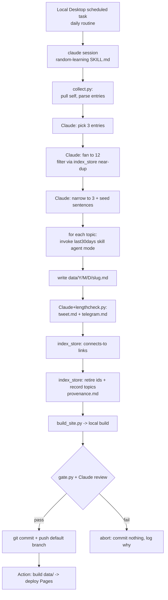

# feat: Random Learning daily pipeline

## Summary

Build a Python-based daily pipeline, driven by an in-repo `random-learning` Claude skill, that mines the private `self` link library, has Claude pick 3 entries → fan to 12 adjacent topics → narrow to 3, researches each by invoking the installed `last30days` skill in agent mode, and commits dated briefs + length-checked social files + a regenerated static site to this repo — deduped against a committed index, gated by a self-review pass, and fired daily by a Local Desktop scheduled task (Claude Code routine) on an always-on Mac Mini, with a cloud heartbeat for liveness.

---

## Problem Frame

Links pile up in the private `self` repo faster than they get learned from, with no ritual that turns the library into daily grounded learning and no record of what's been explored. Full motivation and product decisions live in the origin requirements doc (see Sources & References).

---

## Requirements

**Source ingestion**
- R1. Collect eligible entries from `self` across `YYYY-wNN/` week dirs, parsing TOML frontmatter + body + `why?`.
- R2. Exclude non-entry files (`*-reflection.md`, `*-echo.md`), entries whose `kind` is outside the configured allowlist (default `["url"]`), and entries whose `id` is already retired.

**Selection (Claude-judged)**
- R3. Pick 3 eligible entries per run, weighting the `why?` note, then `tags` and variety.
- R4. Expand to exactly 12 adjacent topics, excluding near-duplicates of past topics.
- R5. Narrow the 12 to the top 3 (curiosity, freshness, learnability).
- R6. Write one framing sentence per final topic as the `last30days` query.

**Research**
- R7. For each final topic, invoke the `last30days` skill in agent mode and capture the synthesized brief.
- R8. Save each brief as a separate markdown file under `data/YYYY/MM/DD/`.

**Dedup, provenance, connections**
- R9. Maintain a structured index recording retired source `id`s, published topics, and a near-duplicate signature per topic.
- R10. Near-duplicate guard blocks exact/semantic repeats (v1: tag/title overlap + Claude judgment; embeddings deferred).
- R11. Record per-run provenance: 3 source links, 12 candidates, why the final 3 won.
- R12. For each published topic, store a "connects to" link to the most-related past topic(s), surfaced on the site.

**Social artifacts**
- R13. Generate `tweet.md` (≤ 280 chars) from the day's briefs.
- R14. Generate `telegram.md` (≤ 4096 chars) from the day's briefs.

**Website**
- R15. Generate a static site from all dated entries, browsable by date, showing topics, briefs, provenance, and connections.
- R16. The site rebuilds and deploys automatically when a new dated entry is pushed.

**Automation & review gate**
- R17. The pipeline runs unattended as a single daily local scheduled task on the Mac Mini, orchestrated by an in-repo skill.
- R18. A self-review gate verifies every artifact before commit (non-empty/well-formed briefs, length limits, citations, no error markers, dedup not violated, connections resolve).
- R19. On gate failure the run commits nothing and surfaces why.
- R20. On gate pass, commit and push all artifacts to the default branch.

**Hardening (plan-level)**
- R21. Out-of-band liveness: alert when no new dated entry has landed for N days (catches silent task failure / structural gate-fails).
- R22. Privacy: raw private `self` URLs and personal `why?` notes never appear in committed/public artifacts; the gate fails on a leak.
- R23. Injection safety: research content is treated as data; the daily run follows a fixed sequence and the gate rejects instruction-shaped strings / frontmatter overrides in briefs and social files.
- R24. Supply liveness: measure the eligible-entry pool and alert on low fuel; never silently starve.

**Origin actors:** A1 (scheduler), A2 (Claude orchestrator), A3 (last30days skill), A4 (self repo), A5 (rl repo), A6 (downstream posting bot — out of scope), A7 (user)
**Origin flows:** F1 (daily learning run), F2 (site publish)
**Origin acceptance examples:** AE1 (R2, R9), AE2 (R4, R10), AE3 (R13, R14, R18), AE4 (R7, R19), AE5 (R12), AE6 (R16, R20)

---

## Scope Boundaries

### Deferred for later

- Weekly/monthly digest roll-ups.
- RSS feed.
- Embeddings-based near-duplicate guard (v1 uses tag/title overlap + Claude judgment).
- Engagement feedback loop nudging future selection.

### Outside this product's identity

- Actually posting to X/Telegram — the downstream bot owns posting; this project only writes the files.
- Audience-growth machinery (SEO, polls, follower funnels) — personal ritual, not a content business.
- Cloud/multi-user execution — single-user, runs on the user's own Mac Mini.

### Deferred to Follow-Up Work

- SQLite migration for the index if `index.json` grows unwieldy (revisit past ~1–2 years of entries).
- Accurate X-style char counting (URLs counted as 23, emoji width) — v1 uses Python `len()`; revisit once the downstream bot's exact counting rule is known.

---

## Context & Research

### Relevant Code and Patterns

- Greenfield repo — no existing local patterns. One artifact present: `docs/brainstorms/2026-06-07-random-learning-requirements.md`.
- `self` entry format (verified from one sample): TOML frontmatter delimited by `+++` with fields `id, kind, source, captured_at, local_date, iso_week, week_idx, url, telegram_msg_id, title, tags`; body = description + repeated URL + a `why?` section with a personal note; files named `YYYY-MM-DD-NNNNNN-<slug>.md` inside `YYYY-wNN/` dirs; per-day `*-reflection.md` / `*-echo.md` files mixed in.
- `last30days` skill installed at `~/.claude/skills/last30days` (verified): `SETUP_COMPLETE=true`, Python 3.12/3.13/3.14 available. Engine is `scripts/last30days.py` (`--emit`, `--save-dir`, `--save-suffix`, `--plan`, `--x-handle`, etc.). `--agent` is a SKILL-level signal to the hosting model (skip interactive prompts/pauses), not a `last30days.py` flag — the skill drives the engine internally.

### Institutional Learnings

- None — no `docs/solutions/` directory in this greenfield repo.

### External References

- Skipped by decision (greenfield, low-risk, well-understood stack). The one infrastructure dependency (`last30days` agent-mode contract) was verified directly against the installed skill rather than via external docs.

---

## Key Technical Decisions

- **One Python toolchain (3.12+).** All helper scripts are Python, matching `last30days`. Frontmatter parsed with stdlib `tomllib`; site templated with Jinja2. Avoids adding a JS toolchain to the Mac Mini.
- **Trigger = a daily Local Desktop scheduled task (a Claude Code "routine," Local variant) on the always-on Mac Mini.** Chosen over `/loop` (7-day expiry, needs a babysat session) and a cloud/Remote routine (runs on Anthropic infra from a fresh clone — can't reach the local Chrome X session, would need `last30days` + the skill vendored into the repo, Full network, keys as cloud env). The Local task is **durable** (persists across restarts, no expiry), runs on the Mac Mini with the **local env** (`gh` auth, `FROM_BROWSER=chrome`, API keys, installed `last30days`), **spawns its own session per run** (no open `tmux` needed, no context accumulation), and has **per-task configurable permissions** — which resolves the headless-permission blocker without hand-crafting `claude -p` flags. All run state lives on disk (`index.json`, `data/`), so each run is self-contained.
- **Git auth = `gh`-authenticated HTTPS on the Mac Mini.** No SSH/1Password agent (that was a wrong-machine assumption — this laptop differs from the Mac Mini). The `gh` credential helper pushes unattended; U1 uses the HTTPS remote.
- **`last30days` driven as a sub-skill in agent mode, not by calling `last30days.py` directly.** Claude invokes the `last30days` skill per topic so its full Step 0.5 resolution + `--plan` synthesis + voice contract produce the brief; the synthesized markdown is captured to the dated file. Raw evidence goes to a non-committed temp dir via `LAST30DAYS_MEMORY_DIR` (agent mode auto-saves there regardless) — never committed.
- **Pin the `last30days` engine path + version.** Reconcile the version skew (`~/.claude/skills` = 3.3.0 vs cache = 3.1.1) and the stale `marketplaces/last30days-skill` clone the skill's own STEP 0 flags; assert the resolved version each run so an unattended session can't silently load a stale engine.
- **`FROM_BROWSER=chrome` is correct for the Mac Mini** (this laptop has `brave`; the Mac Mini's logged-in X session is in Chrome). Chromium cookie reads fire a one-time macOS Keychain prompt — grant "always allow" once in the live session; fall back to `AUTH_TOKEN`/`CT0` env vars if it can't be made silent.
- **Untrusted research is data, not instructions.** The daily skill runs a fixed sequence and never lets brief content redirect the orchestrator (no shell/post/push it didn't plan). The gate scans briefs and social files for instruction-shaped strings and frontmatter overrides (e.g., a model-set `ready: true`). Blast radius matters more in a live session holding `gh` auth + logged-in X cookies.
- **Public artifacts are redacted.** Raw private `self` URLs and personal `why?` notes never reach committed/public artifacts (provenance keeps topic-level rationale only); the gate fails on a leaked raw `self` URL or `why?` string. (Pending `rl`/Pages visibility — see Open Questions.)
- **Index = single committed `index.json`.** Git-friendly, diffable, small volume (~1k topics/year). SQLite deferred (see Follow-Up).
- **Near-dup guard v1 = token/tag Jaccard pre-filter + Claude judgment on borderline candidates.** Store per published topic `{title, normalized_tokens, tags, date, slug, path}`. Flag when Jaccard(tokens∪tags) ≥ a high threshold OR when Claude judges it a duplicate. **Below an index size of K, rely on the Claude-judgment path rather than the threshold** (Jaccard under-blocks when the index is tiny); IDF-weight tokens so generic cluster vocabulary (`ai`, `agent`) doesn't saturate the score and over-block a whole interest area. Embeddings deferred.
- **Connections reuse the same signatures.** "Related" = past topics above a lower overlap threshold than the dedup cutoff; store top-N as the "connects to" links.
- **Static site = minimal Python + Jinja2 generator → static HTML.** Full control over rendering the connections graph; same toolchain. Generated HTML is build output (gitignored); committed content is the markdown under `data/`. GitHub Pages deploys via Actions building from `data/` on push. Local build runs only to feed the gate.
- **Fail-closed gate + out-of-band liveness.** Commit happens only after the gate passes; otherwise the run aborts and commits nothing. Because fail-closed + unattended can silently produce nothing for weeks, a scheduled GitHub Action checks `data/` freshness and alerts when no new entry has landed for N days (independent of the Mac Mini).
- **Social file format (provisional):** small frontmatter (`platform`, `char_count`, `generated_at`, `ready`) + plain-text body. `ready` is gate-set, not model-set. Confirm against the downstream bot's contract before relying on it.
- **Eligible entries:** files with entry frontmatter containing a `url` and `kind` in a configurable allowlist (default `["url"]`); skip `*-reflection.md` / `*-echo.md` and files lacking entry frontmatter. Measure the real eligible-pool size + capture rate against live `self` before building (retire-forever consumes a finite pool); add a low-fuel alert and a documented starve policy.

---

## Open Questions

### Resolved During Planning

- last30days unattended behavior: agent-mode signal suppresses AskUserQuestion + pauses; first-run wizard already complete (`SETUP_COMPLETE=true`). **Resolution:** invoke as a sub-skill in agent mode; the gate asserts the engine's badge/footer to prove it ran, with a wall-clock timeout so a stray prompt fails fast instead of hanging.
- Source depth: `FROM_BROWSER=chrome` on the Mac Mini (live X session) + `BRAVE_API_KEY` web backend give Reddit + HN + Polymarket + web + X. **Resolution:** rely on these; one-time Keychain "always allow" for Chrome cookies (fallback `AUTH_TOKEN`/`CT0`); degrade gracefully if a source is unavailable.
- Index storage: **Resolution:** single committed `index.json`.
- Site generator: **Resolution:** Python + Jinja2 custom generator; GitHub Pages via Actions.
- Scheduler: **Resolution:** a daily **Local Desktop scheduled task** (Local routine) on the Mac Mini — durable, local env, per-task permissions; no `/loop`, no headless `claude -p` flags, no babysat session.
- Git auth (Mac Mini): **Resolution:** `gh`-authenticated HTTPS; no SSH/1Password dependency.

### Resolve Before Implementation

- `rl` repo / GitHub Pages visibility (public or private)? Drives how aggressively R22 redaction applies. Default assumption: **treat the site as public → redact raw `self` URLs + `why?` notes**; relax only if confirmed private.

### Deferred to Implementation

- Exact filename/format/location the downstream posting bot expects for `tweet.md`/`telegram.md` — design to be easy to adapt.
- Final near-dup Jaccard thresholds, the early-life index-size cutoff K, and the connections threshold — tune against real data during U3.
- Verify the Local scheduled task can invoke the user-level `last30days` sub-skill and `gh` push under its permission config (spike in U9).
- Verify Chrome cookie extraction is silent in the scheduled-task context after the one-time Keychain grant (fallback `AUTH_TOKEN`/`CT0`).
- Whether to also surface `reflection`/`echo` content anywhere (currently skipped) — revisit if useful.

---

## Output Structure

    rl/
    ├── .claude/
    │   └── skills/
    │       └── random-learning/
    │           ├── SKILL.md                 # daily orchestration sequence Claude follows
    │           ├── scripts/
    │           │   ├── collect.py            # pull self, parse entries -> normalized JSON
    │           │   ├── index_store.py        # dedup/index: retire, record, near-dup, related
    │           │   ├── lengthcheck.py        # validate tweet/telegram char limits
    │           │   ├── build_site.py         # render data/** -> site/ (Jinja2)
    │           │   └── gate.py               # self-review checks -> pass/fail
    │           ├── templates/                # Jinja2 site templates (base, index, day)
    │           └── references/
    │               └── selection-guidance.md # how to pick 3 / fan 12 / narrow 3 / write seeds
    ├── data/
    │   └── YYYY/MM/DD/
    │       ├── <slug>.md                     # one last30days brief per topic (x3)
    │       ├── tweet.md
    │       ├── telegram.md
    │       └── provenance.md                 # 3 links -> 12 candidates -> why 3 won (redacted)
    ├── index.json                            # dedup + topics + signatures + connections
    ├── tests/                                # pytest suite for the helper scripts
    ├── .github/workflows/
    │   ├── publish-site.yml                  # build + deploy site on push
    │   └── heartbeat.yml                     # scheduled: alert if data/ is stale (liveness)
    ├── requirements.txt
    ├── .gitignore                            # ignores site/ build output, raw evidence, caches
    └── README.md

---

## High-Level Technical Design

> *This illustrates the intended approach and is directional guidance for review, not implementation specification. The implementing agent should treat it as context, not code to reproduce.*

Two actors do the work: deterministic Python scripts (`collect`, `index_store`, `lengthcheck`, `build_site`, `gate`) own anything where correctness is mechanical; Claude owns selection judgment, social-copy drafting, the agent-mode `last30days` invocations, and the final review. The in-repo `SKILL.md` is the script Claude follows each run.

---

## Implementation Units

### U1. Repo scaffolding, config, and test harness

**Goal:** Establish the greenfield repo: git init + remote, directory skeleton, Python deps, gitignore, README, and a runnable pytest harness so later units are test-first.

**Requirements:** (enabling) R17

**Dependencies:** None

**Files:**
- Create: `requirements.txt` (jinja2, pytest; tomllib is stdlib)
- Create: `.gitignore` (`site/`, `__pycache__/`, `.venv/`, self-repo cache dir)
- Create: `README.md` (what it is, how to run one cycle manually, how the schedule works)
- Create: `.claude/skills/random-learning/` skeleton dirs (`scripts/`, `templates/`, `references/`)
- Create: `data/.gitkeep`
- Create: `tests/conftest.py` (fixtures: a sample `self` week dir + sample entry/reflection/echo files; a temp `index.json`)
- Test: `tests/test_smoke.py`

**Approach:**
- `git init`, set `origin https://github.com/momentmaker/rl.git` (push via `gh`-authed HTTPS), default branch `main`.
- Pin Python 3.12+ in README; scripts run via the resolved interpreter.
- Build sample fixtures mirroring the verified `self` format (one `kind=url` entry with `why?`, one `*-reflection.md`, one `*-echo.md`) for reuse across U2/U3/U6/U7.

**Patterns to follow:**
- Mirror the verified `self` entry shape from Context & Research for fixtures.

**Test scenarios:**
- Happy path: `tests/test_smoke.py` imports each script module without error (proves package layout + deps resolve).

**Verification:**
- `pytest` runs green on the smoke test; repo has a remote and the skeleton tree exists.

---

### U2. Source collector (`collect.py`)

**Goal:** Pull `self` and emit a normalized JSON list of eligible entries.

**Requirements:** R1, R2

**Dependencies:** U1, U3 (for the retired-id check)

**Files:**
- Create: `.claude/skills/random-learning/scripts/collect.py`
- Test: `tests/test_collect.py`

**Approach:**
- Clone-or-pull `self` into a local cache dir (configurable; default outside the repo).
- Recursively walk `YYYY-wNN/` dirs; parse `+++ ... +++` TOML frontmatter with `tomllib` + body (description + `why?`).
- Classify: eligible iff has `url` and `kind` in the allowlist; skip `*-reflection.md` / `*-echo.md` and frontmatter-less files; skip ids returned as retired by `index_store`.
- Emit normalized records: `{id, title, url, tags, why, kind, captured_at, iso_week, path}` to stdout as JSON.
- Sync-failure policy: if the `self` clone/pull fails (network, auth), abort the run with a logged reason rather than proceeding on a silently-stale cache.
- One-time before building: run against live `self` and report the eligible-pool size + recent capture rate (feeds the starve policy, U11).

**Patterns to follow:**
- Reuse U1 fixtures.

**Test scenarios:**
- Covers AE1. Edge case: an entry whose `id` is retired in the index is excluded from output.
- Happy path: a well-formed `kind=url` entry is parsed with `why` and `tags` populated.
- Edge case: `*-reflection.md` and `*-echo.md` files are skipped.
- Edge case: a file with malformed/absent frontmatter is skipped without crashing.
- Edge case: an entry with `kind` outside the allowlist is excluded.
- Edge case: zero eligible entries (all retired / reflections only) emits `[]` cleanly for the orchestrator to handle as a no-op.
- Error path: a failed `self` clone/pull aborts with a clear reason (no silent stale-cache run).
- Integration: given a fixture week dir with mixed files, output contains exactly the eligible entries.

**Verification:**
- Running `collect.py` against the fixture self-dir yields the expected normalized JSON; a one-time run against live `self` reports the actual eligible-pool size + capture rate.

---

### U3. Index store: dedup, near-duplicate guard, connections (`index_store.py`)

**Goal:** Own `index.json` and all read/write + similarity logic.

**Requirements:** R9, R10, R11, R12

**Dependencies:** U1

**Files:**
- Create: `.claude/skills/random-learning/scripts/index_store.py`
- Test: `tests/test_index_store.py`

**Approach:**
- API (importable module; optional `__main__` debug entry only — no CLI subcommand surface, the only caller is the skill's Python which imports directly): `is_retired(id)`, `retire(ids)`, `record_topic(topic, signature, date, slug, path)`, `near_dup_candidates(topic) -> [{topic, score}]`, `related(topic, k) -> [...]`, `bootstrap()` (empty index).
- Signature = `{normalized_tokens, tags}`; similarity = IDF-weighted Jaccard over `tokens ∪ tags` so generic cluster vocabulary (`ai`, `agent`) doesn't saturate the score.
- Below an index size of K, the near-dup decision defers to Claude judgment (the threshold under-blocks on a tiny index).
- `near_dup_candidates` returns matches above the dedup threshold (for the guard); `related` returns matches above a lower threshold excluding self/exact (for connections).
- Atomic writes (temp file + rename) so a crashed run never corrupts the index.

**Technical design:** *(directional)*
- `near-dup` is a pre-filter: it surfaces the top-K overlapping past topics and a score; the final dup/keep call for borderline scores is made by Claude in U4, not inside this script.

**Patterns to follow:**
- Stdlib only (`json`, `re`); no external deps.

**Test scenarios:**
- Covers AE2. Happy path: a candidate near-identical to a recorded topic scores above the dedup threshold (flagged).
- Happy path: a clearly unrelated candidate scores below threshold (not flagged).
- Happy path: `related()` ranks a moderately-overlapping past topic above an unrelated one and excludes the exact self.
- Edge case: with a tiny index (< K), the threshold path is bypassed in favor of the Claude-judgment path.
- Error path (over-block): 5+ topics sharing a tag core (cluster) do NOT all score as mutual dups — IDF weighting keeps a genuinely-new cluster member admissible.
- Edge case: empty/missing `index.json` bootstraps cleanly; first `record_topic` persists.
- Edge case: `retire`/`is_retired` round-trips a set of ids.
- Error path: a concurrent/interrupted write leaves `index.json` valid (atomic rename).

**Verification:**
- All similarity and persistence tests pass; threshold constants are named and documented for tuning.

---

### U4. Orchestration skill: selection, research, provenance (`SKILL.md` + guidance)

**Goal:** Author the in-repo skill that Claude follows each run: collect → pick 3 → fan to 12 (near-dup filtered) → narrow to 3 → seed sentences → invoke `last30days` per topic in agent mode → write dated briefs → write provenance → record topics/connections/retire ids.

**Requirements:** R3, R4, R5, R6, R7, R8, R11, R12

**Dependencies:** U2, U3

**Files:**
- Create: `.claude/skills/random-learning/SKILL.md`
- Create: `.claude/skills/random-learning/references/selection-guidance.md`

**Approach:**
- `SKILL.md` is the ordered daily procedure: which scripts to call (U2/U3) and where Claude exercises judgment.
- Selection guidance: weight `why?` heaviest, then tags + variety; fan to exactly 12 adjacent topics; consult `index_store.near_dup_candidates` and drop near-dups; narrow to 3 on curiosity/freshness/learnability; write one discussion-shaped seed sentence per topic (explicitly avoid keyword-trap phrasing so `last30days` returns signal).
- Research step: assert the resolved `last30days` engine version first; for each topic, invoke the `last30days` **skill** with the seed sentence + agent-mode signal; set `LAST30DAYS_MEMORY_DIR` to a non-committed temp dir for raw evidence; capture the synthesized brief and write it to `data/YYYY/MM/DD/<slug>.md`.
- Injection safety: the procedure is a fixed sequence; brief/research content is data only and must never redirect the orchestrator into shell/post/push actions it didn't plan. The skill writes social `ready: false` provisionally (the gate, U7, decides `ready`).
- After research: `index_store.record_topic` for each (+ `related` for connections), `retire` the 3 source ids, write a **redacted** `provenance.md` (topic-level rationale + 12 candidates; no raw `self` URLs or `why?` text when the site is public).

**Execution note:** Skill-authoring unit — verification is a manual dry-run on one real day, not unit tests. Author the SKILL.md, then dry-run end-to-end before wiring automation (U9).

**Patterns to follow:**
- Follow `~/.claude/skills/last30days/SKILL.md` agent-mode contract for non-interactive invocation.
- House skill conventions (progressive disclosure: thin SKILL.md + references/).

**Test scenarios:**
- Test expectation: none (skill prose). Behavioral correctness is proven by U2/U3/U5/U7 unit tests plus the U4 dry-run.

**Verification:**
- A manual dry-run produces 3 briefs under `data/YYYY/MM/DD/`, a `provenance.md`, updated `index.json` (3 retired ids + 3 topics + connections), and no repeats vs. existing index entries.

---

### U5. Social artifacts + length checks (`lengthcheck.py` + skill step)

**Goal:** Produce `tweet.md` (≤ 280) and `telegram.md` (≤ 4096) from the day's briefs, with hard length validation.

**Requirements:** R13, R14

**Dependencies:** U4

**Files:**
- Create: `.claude/skills/random-learning/scripts/lengthcheck.py`
- Test: `tests/test_lengthcheck.py`
- (Skill step added to `SKILL.md`: Claude drafts both files from the 3 briefs, then runs `lengthcheck.py`.)

**Approach:**
- `lengthcheck.py <file> --max N` exits non-zero with a clear message when the body exceeds the limit; prints char count on success.
- Claude drafts `tweet.md` (concise) and `telegram.md` (medium) reflecting the 3 topics; writes provisional frontmatter (`platform`, `char_count`, `generated_at`, `ready`).
- v1 counts characters with Python `len()` on the body (X/emoji nuances deferred — see Follow-Up).

**Test scenarios:**
- Covers AE3. Edge case: a 281-char tweet body fails; 280 passes.
- Edge case: a 4097-char telegram body fails; 4096 passes.
- Edge case: empty body fails (nothing to post).
- Happy path: a valid file prints the correct char count and exits 0.

**Verification:**
- Length checks gate correctly at the boundaries; both files exist with accurate `char_count` frontmatter.

---

### U6. Static site generator (`build_site.py` + templates)

**Goal:** Render all dated entries into a browsable static site showing topics, briefs, provenance, and connection links.

**Requirements:** R12, R15

**Dependencies:** U3 (connections data), U4 (brief/provenance shape)

**Files:**
- Create: `.claude/skills/random-learning/scripts/build_site.py`
- Create: `.claude/skills/random-learning/templates/base.html`
- Create: `.claude/skills/random-learning/templates/index.html`
- Create: `.claude/skills/random-learning/templates/day.html`
- Test: `tests/test_build_site.py`

**Approach:**
- Walk `data/YYYY/MM/DD/`, render an index (reverse-chronological) and per-day pages (the 3 briefs as HTML, provenance, and "connects to [past topic]" links resolved from the index/connections).
- Output to `site/` (gitignored); the same script runs in CI (U8) and locally for the gate (U7).
- Markdown → HTML via a minimal renderer (a small dep or stdlib-based); keep styling simple/self-contained.
- Privacy: when the site is public, render only redacted provenance (topic-level rationale) — never raw `self` source URLs or personal `why?` notes.

**Test scenarios:**
- Covers AE5. Integration: given a fixture `data/` with two related days, the newer day page renders a "connects to" link to the older topic.
- Happy path: index lists days reverse-chronologically with correct titles/dates.
- Happy path: a day page renders all 3 briefs + provenance.
- Error path: a page never renders a raw `self` source URL or an unredacted `why?` note (privacy).
- Edge case: empty `data/` produces a valid (empty-state) index without crashing.

**Verification:**
- `build_site.py` produces valid HTML from the fixture and from real `data/`; connection links resolve to existing pages.

---

### U7. Self-review gate (`gate.py` + skill review step)

**Goal:** Validate every artifact before commit; pass/fail with reasons.

**Requirements:** R18, R19, R22, R23

**Dependencies:** U5, U6

**Files:**
- Create: `.claude/skills/random-learning/scripts/gate.py`
- Test: `tests/test_gate.py`
- (Skill step in `SKILL.md`: run `gate.py`; if it passes, Claude does a final qualitative review (citations present, briefs read coherently); only then commit.)

**Approach:**
- Mechanical checks in `gate.py`: 3 brief files exist and are non-empty/parse; each brief carries the mandatory `🌐 last30days` badge + `✅ All agents reported back!` footer (proves the engine ran); lengths via `lengthcheck.py`'s exit code (no reimplementation) — `tweet.md` ≤ 280, `telegram.md` ≤ 4096; no error markers (`## Pre-Research Status`, empty-engine sentinels); today's topics not already retired/duplicated; connection links resolve; **no instruction-shaped strings or frontmatter overrides** (e.g., `ignore previous`, a brief setting `ready: true`) in briefs/social files; **no raw `self` URL or `why?` leak** in committed/public artifacts; site build succeeded.
- The gate sets `ready` (never the model); returns structured pass/fail (exit code + JSON reasons) so the skill can log why on abort.
- Claude layer adds the non-mechanical judgment (do the briefs actually say something).

**Test scenarios:**
- Covers AE4. Error path: an empty/`Pre-Research-Status` brief → gate fails.
- Error path: a brief missing the engine badge/footer → gate fails (engine didn't run).
- Error path: over-limit `tweet.md` (via `lengthcheck.py`) → gate fails.
- Error path: a brief/social file containing an instruction-shaped string or a `ready: true` override → gate fails.
- Error path: a committed artifact containing a raw `self` URL / `why?` note → gate fails (privacy).
- Error path: a published topic already present in the index → gate fails (dedup violated).
- Error path: a dangling connection link → gate fails.
- Happy path: a complete, valid day → gate passes with exit 0.

**Verification:**
- Each failure mode yields a non-zero exit with a specific reason; a good day passes.

---

### U8. GitHub Pages publish workflow

**Goal:** Build the site from `data/` and deploy to GitHub Pages automatically on push.

**Requirements:** R16

**Dependencies:** U6

**Files:**
- Create: `.github/workflows/publish-site.yml`

**Approach:**
- Trigger on push to `main` touching `data/**` (and templates/build script).
- Steps: checkout → set up Python → install deps → run `build_site.py` → `actions/upload-pages-artifact` → `actions/deploy-pages`.
- Enable Pages (Actions source) on the repo as a one-time setup noted in README.

**Test scenarios:**
- Test expectation: none (CI config). Verified by a green Actions run + live site.

**Verification:**
- Pushing a dated entry triggers the workflow; the deployed site shows the new day.

---

### U9. Local Desktop scheduled task + commit/push

**Goal:** Fire the pipeline daily on the Mac Mini via a Local Desktop scheduled task and commit/push on gate pass.

**Requirements:** R17, R20

**Dependencies:** U4, U7

**Files:**
- Modify: `.claude/skills/random-learning/SKILL.md` — final step: on gate pass, `git add/commit/push` via the `gh`-authed HTTPS remote; on gate fail, commit nothing and log the reason.
- Doc only: README section — how to create the Local Desktop scheduled task (Claude Code Desktop → Routines → New routine → **Local**), the daily schedule, the per-task permission set (allow Bash/Write/Read/Edit + skill invocation), the env it injects (`BRAVE_API_KEY`, `FROM_BROWSER=chrome`), and the one-time Keychain "always allow" grant.

**Approach:**
- The Local task runs the in-repo `random-learning` skill once daily; per-task permissions grant the tools the run needs (no `claude -p` flag-crafting). It spawns its own session each run, so state is read fresh from `index.json` + `self`.
- Git auth is `gh`-authenticated HTTPS (no SSH/1Password); push happens only after the gate passes.
- **Spike (do first):** prove the Local task can (a) run the in-repo skill, (b) invoke the user-level `last30days` sub-skill, (c) Write files, (d) `gh`/git push — before relying on it daily.

**Execution note:** Integration/ops unit — verify by a manual skill run, then one real scheduled fire, before trusting it daily. Test the failure path (forced gate-fail commits nothing).

**Test scenarios:**
- Test expectation: none (ops/integration). Verified by a manual full-cycle run + one scheduled fire producing a committed, pushed dated entry; a forced gate-fail commits nothing.

**Verification:**
- The in-repo skill run by hand completes a full cycle and pushes; the Local scheduled task fires daily and produces the same result; a forced gate-fail commits nothing; the spike confirmed sub-skill invocation + push under the task's permissions.

---

### U10. Liveness heartbeat (GitHub Action)

**Goal:** Detect and alert when the pipeline silently stops producing entries.

**Requirements:** R21

**Dependencies:** U8

**Files:**
- Create: `.github/workflows/heartbeat.yml`

**Approach:**
- Scheduled Action (e.g., daily) checks the newest `data/YYYY/MM/DD/` entry's age; if no new entry for N days, open/refresh a GitHub issue (and/or ping a channel) so the silence is visible independently of the Mac Mini.
- Distinguish an expected occasional gap (1 day) from a structural fault (N consecutive) via the threshold.

**Test scenarios:**
- Test expectation: none (CI config). Verified by a forced stale-`data/` run triggering the alert and a fresh-`data/` run staying quiet.

**Verification:**
- With `data/` older than N days, the Action raises the alert; with a recent entry, it stays quiet.

---

### U11. Supply-liveness: low-fuel alert + starve policy

**Goal:** Never silently starve when the eligible `self` pool runs low.

**Requirements:** R24

**Dependencies:** U2, U3

**Files:**
- Modify: `.claude/skills/random-learning/scripts/collect.py` (or a small `fuel.py`) — report eligible-pool size + runway.
- Modify: `.claude/skills/random-learning/SKILL.md` — low-fuel branch + circuit-breaker.

**Approach:**
- Before spending on research, compute the eligible-pool size; if below a threshold (or fewer than N days of runway at 3/day), take the documented starve policy: skip the run cleanly and raise a low-fuel alert (out-of-band), rather than failing the gate or burning tokens on an empty pool. The policy also defines whether to relax retirement to re-explore old entries from new angles.

**Test scenarios:**
- Edge case: eligible pool below threshold → run short-circuits before research, raises low-fuel alert, commits nothing.
- Happy path: ample pool → normal run.

**Verification:**
- A near-empty fixture pool triggers the low-fuel path and skips research; a healthy pool runs normally.

---

## System-Wide Impact

- **Interaction graph:** Local Desktop scheduled task → `claude` session (SKILL.md) → {`collect.py`, `index_store.py`, `last30days` skill, `lengthcheck.py`, `build_site.py`, `gate.py`} → `gh` push → GitHub Actions (publish + heartbeat) → Pages.
- **Error propagation:** any script non-zero exit or failed gate aborts the run before commit; the wrapper logs the reason and exits without pushing (fail-closed).
- **State lifecycle risks:** `index.json` is the only mutable shared state — atomic writes (U3) prevent corruption; ids are retired and topics recorded only after briefs are written and the gate passes, so a mid-run abort doesn't leave the index ahead of the data.
- **API surface parity:** none (single surface).
- **Integration coverage:** the U4 dry-run and the U9 real fire are the cross-layer proofs that unit tests can't give (skill ↔ last30days ↔ scripts ↔ git ↔ CI).
- **Unchanged invariants:** the `self` repo is read-only; this pipeline never writes to it.

---

## Risks & Dependencies

| Risk | Mitigation |
|------|------------|
| `last30days` pauses or errors unattended | Agent-mode signal + per-task permissions that deny interactive prompts; wall-clock timeout so a stray prompt fails fast; gate asserts the engine badge/footer and fails closed on empty/error briefs. |
| Stale `last30days` engine loads (3.3.0 vs 3.1.1 + marketplace clone) | Pin/assert the resolved engine path + version each run; reconcile or remove the stale marketplace clone. |
| A weak seed produces a thin/keyword-trap result | Selection guidance writes discussion-shaped seeds; gate rejects `Pre-Research Status`/empty briefs. |
| Silent dead pipeline (fail-closed + unattended) | Out-of-band heartbeat GitHub Action alerts on N days without a new `data/` entry (R21, U10); local run log distinguishes occasional bad-data fails from structural N-in-a-row fails. |
| Eligible-entry starvation (retire-forever consumes a finite pool) | Measure real pool + capture rate before building (U2); low-fuel alert + documented starve policy (R24, U11). |
| Prompt-injection from untrusted research into auto-published files | Fixed daily sequence; research treated as data; gate scans for instruction-shaped strings + frontmatter overrides; `ready` is gate-set not model-set (R23, U7). |
| Private `self` content leaking to a public site | Redact raw `self` URLs + `why?` from committed/public artifacts; gate fails on a leak (R22, U6/U7); pending visibility confirmation. |
| Chrome cookie read blocks on a Keychain prompt | One-time "always allow" grant in the live session; fallback `AUTH_TOKEN`/`CT0` env; X degrades gracefully if unavailable. |
| `index.json` corruption mid-run | Atomic temp-file + rename writes (U3); index mutated only after gate pass. |
| Jaccard near-dup weak at small index / over-blocks topical clusters | Below index size K, use Claude judgment not the threshold; IDF-weight tokens; cluster-saturation + over-block tests (U3); embeddings deferred. |
| Downstream bot expects a different social-file format | Format provisional with frontmatter; isolated to U5. |
| Daily metered token/API cost, 365×/yr | Circuit-breaker: skip research (and the run) when the eligible pool is empty/low before spending (U11); cost noted as accepted. |

---

## Documentation / Operational Notes

- README documents: one-time setup (Pages source = Actions, `gh auth login` on the Mac Mini, env vars `BRAVE_API_KEY`/`FROM_BROWSER=chrome`, the one-time Chrome-cookie Keychain "always allow" grant, creating the Local Desktop scheduled task + its permission set), how to run one cycle manually, and how to pause/resume the schedule.
- Operational: a per-run log so an aborted day is diagnosable, plus a "last successful run" marker; the heartbeat Action (U10) is the out-of-band alarm and the low-fuel check (U11) is the supply alarm.

---

## Phased Delivery

### Phase 1 — Foundations
- U1 (scaffolding), U3 (index store), U2 (collector) — in that order, since U2's retired-id check depends on U3. Deterministic core, fully unit-tested.

### Phase 2 — Daily brain
- U4 (orchestration skill + selection + last30days capture + provenance). First end-to-end dry-run lands here.

### Phase 3 — Outputs
- U5 (social + length checks), U6 (site generator).

### Phase 4 — Gate & automation
- U7 (self-review gate), U8 (Pages workflow), U10 (liveness heartbeat), U11 (supply-liveness), U9 (Local scheduled task + commit/push). Set-and-forget after the U9 spike + real fire.

---

## Sources & References

- **Origin document:** [docs/brainstorms/2026-06-07-random-learning-requirements.md](docs/brainstorms/2026-06-07-random-learning-requirements.md)
- Related code: `~/.claude/skills/last30days/SKILL.md` and `scripts/last30days.py` (agent-mode + engine contract)
- External docs: Claude Code routines/scheduling — https://code.claude.com/docs/en/routines (decision context for local vs cloud scheduling)
